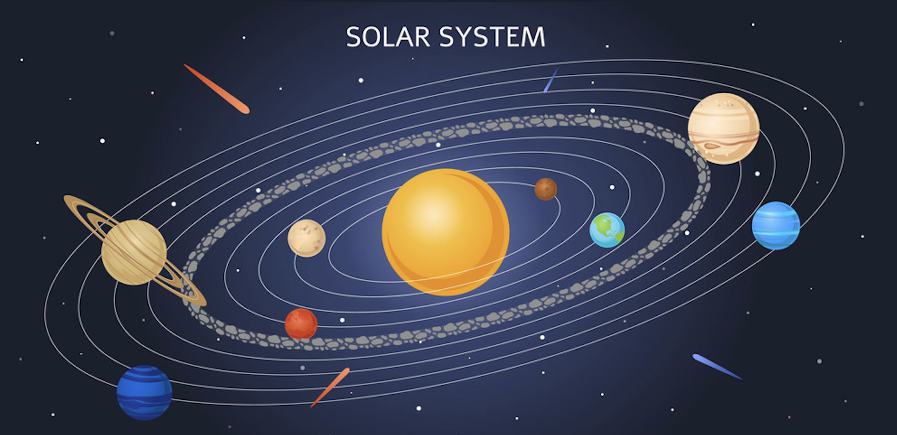

# Assignment 1 - "Solar System"

For this assignment, since the main goal was to use shapes and colors in such a way that together they communicate something more, I decided to make a model of the Solar System.

***
***How I came up with this idea?***

At the very early stage of my branistorming, I searched the internet for different kinds of projects done using openFrameworks, in a hope that I'll get inspired by some of them. Most of the projects that I saw were great but they seemed to be hard to implement. So, I decided to change my strategy and look at the projects of particular artists in this field. That is when I recalled the artist named JunKiyoshi, who was in our Weekly Schedule. His works seemed to match the level of the project that I could implement, so I browsed through his works on his [website](https://junkiyoshi.com) and was inspired by the work called ["Planter"](https://junkiyoshi.com/2021/04/09/), particularly by the curves surrounding the edges of the cube, and the idea of using various curved/straight lines to replace the edges of some geaometrical shapes. But, even though I wanted to follow a similar idea in my code, I still didn't have a concrete image of what I wanted to implement.

Then, I continued browsing through the examples and concepts provided in our Weekly Schedule, and something clicked when I came across the project called ["trigonometryExample"](https://github.com/openframeworks/openFrameworks/tree/master/examples/math/trigonometryExample) from week 4. After seeing how a small cyan circle moved along the larger yellow circle, I suddenly came up with an idea of making a solar system, where every planet moves around the Sun along a fixed orbit, just as a cyan circle moves along the circumference of the yellow circle.

*Solar system model that I followed*

***
***How my progress looked like?***

Now that I knew what I wanted to do, or at least try doing, all that was left was to write the code. 
As with all the big assignments, I decided to stick with the principle of "Divide & Conquer" which is very commonly used by programmers when designing complicated algorithms. First, I fodused on drawing the sun and a planet moving around the sun in an elliptical orbit. For this part of my code, trigonometryExample mentioned above was really helpful as it acted as a starting point for me. I used parametric equations of an ellipse, namely x=a*cos(u) and y=b*sin(u), to get the coordinates of a particular point on an orbit( here, a and b are the radius on the x and y axes respectively; u is the parameter which ranges from 0 to 2π radians). To get several orbits, I just increased a and b values proprotionally when drawing ellipses, and set different starting angles for each of the eight planets to get my planets spread evenly across the solar system.

Initially, I drew planets as circles using ofDrawCircle() function. But then I decided to use an idea of creating a circular shape using large numbers of straight lines, which was inspired from JunKiyoshi's work "Planter". For the Sun, I created two new float variables which will generate a random angle between 0 and TWO_PI - one of them was used as a starting point of the line while the other one - as an ending point. By putting them inside a for loop and setting parametric equations of a circles as a boundary of the max, min values for those x,y values, I was able to create a circular shape.
For the planets, I followed a similar logic, but this time, instead of taking boundary of a circle as a starting point and ending point for a line, I took the center of the circle as a starting point and the boundary as an ending point. As a final step, since the space behind the solar system looked a bit empty, I've added some twinkling stars that I drew using the ofGetRandom() and ofNoise() funstions.

***
***Color***

For the sun, I chose three different colors - yellow, orange, red - and made three groups of lines that make up a sun represent these three colors. I've also added a slider for each of those three groups so that the user can play with it and get different concentrations of yellow, orange, and red by increasing/decreasing the corresponding sliders. The gui with all the sliders can be enabled/disabled by pressing "g".

For each of the planets, I decided to give the user a chance to get colors that vary from the planet's traditional color set, so I chose one traditional RGB color for each of the planets (i.e for Mars - red), divided the lines making up the planet into three groups, used this traditional RGB combination to set the colors of each of the groups with Red, Green, and Blue values varying in each of the groups. So, for example for the Mars, I chose (210,10,10) as a traditional color, and for each of the three grops of lines that make up Mars, I set the color as (x,10,10), (210,x,10), and (210,10,x) respectively, where x is a float varibale that can be controled by the sliders.

I also added sliders that control the color of the orbits as well as their opacity, while for the stars, one group of stars are yellow while the other group has the same color as the color of the orbits.

***
***What I would like to improve?***

I am more or less content with what I have now but if I had more time to work on this project, I would have added sliders that allow user to control the Sun-Planet proportion or increase/decrease their size proportionally. I was also thinking of adding a slider that will allow the user to change the inclination of the solar system as a whole. 
As for the stars, since I added them at the very end, I didn't have much time to work on making them look more realistic and interesting. If I had time, I would work on fixing stars' positions instead of making them appear at the random place evey time draw() function is run. I also think it would be a good idea to add a Milky Way somehwere in the background by making the stars cluster around a certain point. If I had more time and if the academic workload coming from other courses was not so heavy, I would have worked on incorporating these chnages to my project, so that the user could have been able to get more interesting models of solar system. 

Below are the screenshots of my Solar system under different parameters.

*Theme: Traditional Solar System*

*Theme: Darkened planets in a brighter space*

*Theme: Darkened planets in a darker space*

*Theme: Pink space*

