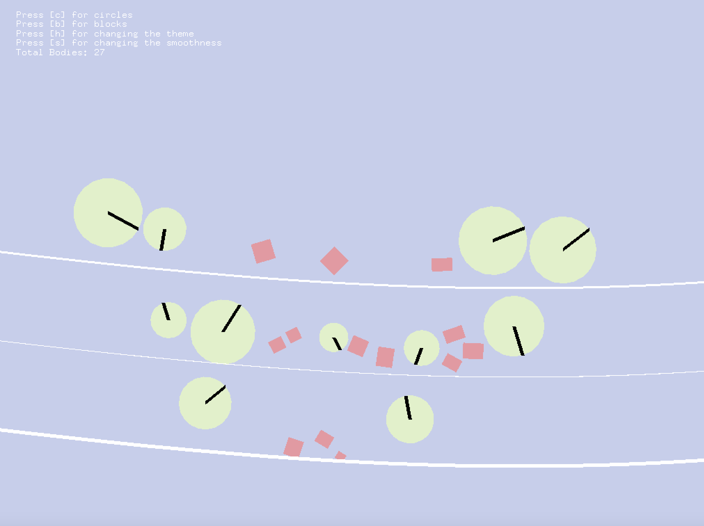
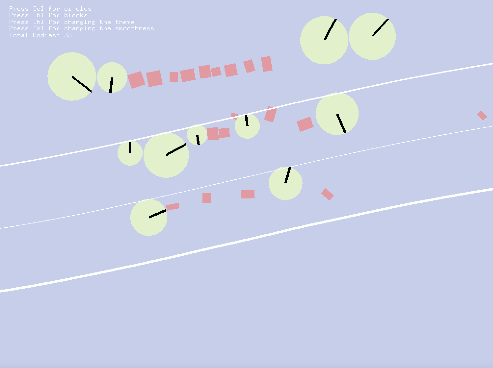

# Assignment 2 - Motion

For this assignment, since the main goal was to focus on the concepts of motion I decided to make a little animation consisting of circles and blocks moving along the path by relying on the physics concepts of real life.

***
***How I came up with this idea?***

I was just seaching through different examples of animated art made in OpenFrameworks (made a google search, then looked at the works of OF artists who we're familiar with - [Zach Lieberman](https://openframeworks.cc/ofBook/chapters/animation.html) and [Junkiyoshi](https://junkiyoshi.com). After that, I started looking at different kinds of addons that we can use for making animation in OpenFrameworks at the [addons library](https://ofxaddons.com/categories). After getting inspired by some of them, I tried to make several mini animations and see how it goes: my original idea was to utilize the concepts such as vector and noise to make an animation of a growing tree but then I decided to give up on this idea because in the porcess of maing it I realized that I need to utilize a lot of vectors for that and that that would be energy consuming and simple, unless I decide to add something else at the background. So, I switched to exploring the addons. I looked at ceveral of them but [ofxPlaylist](https://github.com/tgfrerer/ofxPlaylist) and [ofBox2D](https://github.com/vanderlin/ofxBox2d) caught my attention. After playing around with the examples provided in the documentation of each of the addons I decided to use ofxBox2D addon in this assignment as it perfectly fitted the description of the assignment.

***
***Description of my assignment***

I read thoroughly the documentation of the ofxBox2D addon and looked at all the examples provided with the documentation and played around with different parameters of the code to understand the main commands of the addon along with their main fundtions. I really liked that this addon allowed us to implement the physics concepts such as gravity, bounce, density, etc. into our animation.
This assignment consists of mainly 3 main objects : ground, circle, and block. All of these objects are pushed back into the large 2d world that simulates our real world with gravitaional force, density, friction, and etc. The inspiration for this assignment were the examples provided on the documentaion of ofxBox2D addon.

*Ground:* As in the real life, the ground acts as a supporting line for other objects (cirlces and blocks) and this is where those objects are attracted with the gravitational force pulling them downwards. In the assignment, there are 3 levels of ground of different width, and circles and blocks can be placed on each of them.

*Circes:* Circles here simulate the wheels of the car moving on a road. They are the part of the big 2d world that means they also abide by the physics concepts such as density, friction, and bouncing. In this assigment, the circles can be created by pressing the key "c". Initially, they will be created at the location of our mouse but then they will fall to the ground under the influence of the gravitaional force. Whenever, we create a circle, we specify its physical parameters such as gravity, bounce, density. I'm using default values from the documentation examples for those parameters in my code.

*Blocks:* Blocks are the objects that don't move and they will just fall to the ground whenever created (because it doesn't have circular shape that can simulate reea-life car wheels, instead, they are rectangular). Because of their sharp corners and bounces that they make when the smoothness of the road changes, they can fall from one level of the ground to the other, and eventually may leave the screen.

*Parameters:* User can change the parameters of objects by pressing corresponding key (the texr with the instrustion on which key to press is displayed at the upper left corner of the application). By pressing the keyword "c" and "b", , user can add more circles and blocka into the 2d world, respectively. By pressing "h", user can change the theme of the world. There are 2 themes provided: Pastel(which is a default one) and Contrasting dark.
By pressing "s", user can scrolling speed of the road. There is also a method called getBodyCount() provided as part of this addon which counts the number of objects currently exisiting in our world. The reason for why this number decreases even though we keep adding more circles and blocks into our world is that objects that leave the screen by either falling behind or falling down are not counted as a part of the world.

***
***What I would like to improve?***
If I had more time to work on this assignment, I would add options of adding more objects into our world other than circles and rectangular blocks. I would also play around with the parameters of the scrolling ground and make it change the smoothness as the time passes, not when user will press specific keyword. Same would apply to the theme of the world.

Below are some screenshots of my application and here's the link to the recording of my animation: https://youtu.be/Z427i4yACKU

*Theme: Pastel*

*Theme: Contrasting dark*

