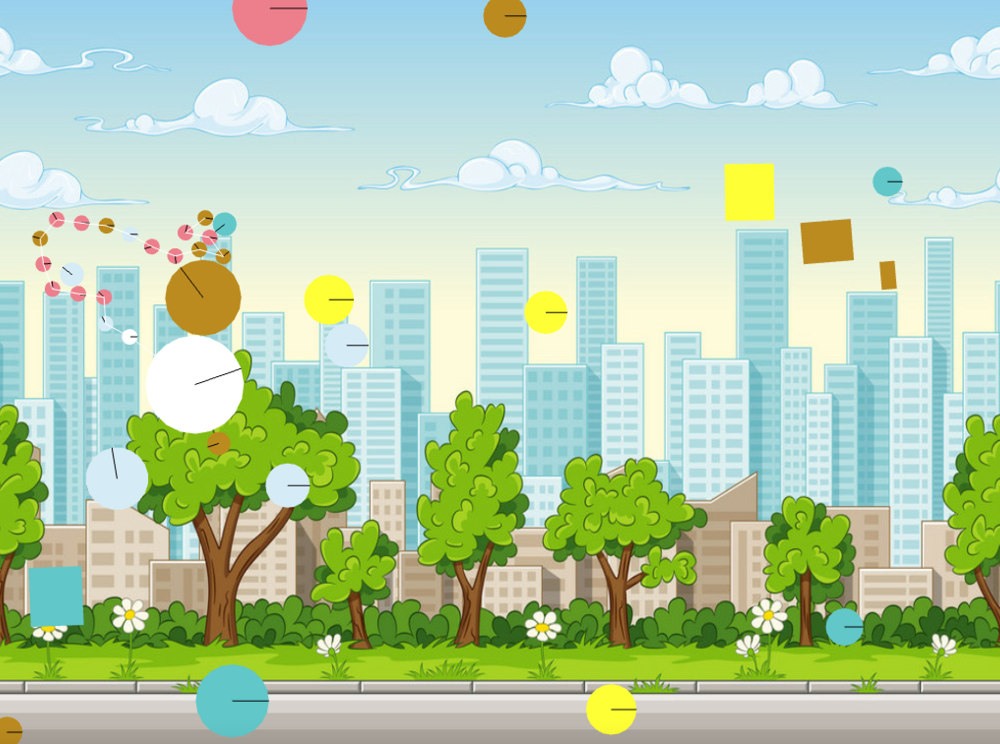

# Assignment 3 -  The story of a circle: A journey into the unknown

In this assignment, I tell the story of adapting to a new environment (or overcoming a crisis) through the use of the features of the ofBox2D addon.
The main protagonist of this story is a white circle and the story consists of 3 phases: React, Adapt, and Evolve.

***
**The conceptual background of the work**

The moment I heard that the main goal of this assignment will be to communicate some story through the use of OpenFrameworks coding techniques that we've learned so far, I immediately decided for myself that this time I will focus more on the conceptual part of the animation, rather than the technical.
Since I was already familiar with the ofBox2D addon and it provides lots of cool features that correspond to different phenomena from real life, I tried to come up with the story where this addon can be implemented.
In every story there is a protagonist, in my story, I wanted to make a basic shape, such as a circle, a protagonist. The idea that I wanted to communicate was the journey of adapting to a new environment because this is a pretty relevant topic for me at the moment. Now that I had an idea, the next step was to find the ways I can communicate this through the use of OpenFrameworks.
I started looking at different features that the [ofBox2D](https://github.com/vanderlin/ofxBox2d) addon provides. This time, I looked at them more in-depth as I knew that I need to adapt them to fit my story.
Initially, I thought that my protagonist will transform into a human by adding more circles and figures to its body. But then I realized that implementing the human body through the use of basic shapes such as circles and rectangles will be hard as it requires lots of computations related to proportion and distance. Then, after some brainstorming and sketching, I stopped at the idea that I will show the transformation of my protagonist through three independent modifications: 

1)changing the color of a protagonist when it collides with another object (phase 1 - React); 

2)attaching the objects to the tail of the protagonist(phase 2 - Adapt);

3)creating one body out of all the objects in the screen (phase 3 - Evolve).

***
**Description of my work and its evolution over time**

*Background, sound, color, and the text:

As I've mentioned above, there are 3 phases in my story and there are also a separate intro and exit screens.
As soon as the program launches, an intro screen appears with an intro text and music. For the text, I downloaded a font from [Google's fonts website](https://fonts.google.com/specimen/Indie+Flower#standard-styles). As for the background music, I spent some time browsing through lots of websites in search of the calm background music that can be used for the animation and that also matches my content. After several hours of browsing, I finally found the one from this [website](https://www.chosic.com/free-music/adventure/) which is called "Enchanted" by Keys of Moon. There is also an explosion sound that occurs near the end of the story which i I downloaded from this [webiste](https://www.zapsplat.com/empty-search/).

The change in the phases that will be descrbied below is accompanied by a change in the background landscape. The images for the background I downloaded from this [website](https://www.vectorstock.com/royalty-free-vector/seamless-cartoon-nature-background-with-separate-vector-20061466).
As for the color of the randomly appearing circles and rectangles, i.e passerby objects, since my story has a vibe on a cartoon with cartoon-like landscape in the background, I looked up for the "cartoon color template" and decided to stick to the "Sponge Bob" color palette found from this [website](https://www.qualitylogoproducts.com/blog/12-color-schemes-from-famous-cartoons/).
All the objects on the screen, including the protagonist, can be controlled by the user by clicking and dragging the objects.

*Phase 1 - React:*

In this phase, circles and rectangles with random colors will be generated from the right end of the screen and the protagonist will react to the collision with passerby circles by changing its color to that of the circle it collided with. For checking the collision, I implemented functions that are called contactStart() and contactEnd(), and for changing the color of the protagonist to the color of the circle it collided with, I create a separate class called ColorData with different attributes that will store the color information of each created object. You can see a more detailed description of those methods in the code itself.

*Phase 2 - Adapt:*

In this phase, the protagonist will react to the collision by adding more circles in its tail and the color of the circle it adds will match that of the circle it collided with. This process of adding some feature to its body depending on the different kinds of experiences the protagonist goes through is what I mean by calling this phase "Adapt". For adding circles, or creating a "tail", I create a separate vector that will store the tail's circles and a vector that will store joints that will be joining the tail's circles to each other.

*Phase 3 - Evolve:*

In this final phase, the protagonist will be attracted to the center and the passerby circles and rectangles will be attracted to the protagonist, creating one whole unit. The final stage of adaptation to a new environment is feeling yourself a part of a new community/environment. After first reacting to differences, and then slowly incorporating different elements of a new environment into your life, you finally become an integrated part of that environment and you will be in the flow with all the other protagonists of that environment. This is the idea that I wanted to communicate through gathering the protagonist and all the passerby objects to the center, with passerby objects surrounding the protagonist.
In the code, I implement this through the use of the addAttractionPoint() function.

The culmination of this story is when the protagonist and the objects that are all attracted to the center will spread out to different parts of the screen away from the center, upon the click of a certain key. I didn't put an important context behind this action, I just thought that culminating the objects that are gathered around the center in this way will be relevant and will also look cool. I perform this method by using the opposite of the attraction force - the repulsion force - following the similar logic as I implemented with addAttractionPoint().

***
**How this work can be improved?**

One possible idea would be to attach some role to the protagonists and passerby objects by adding images of some objects/people/cartoon characters etc.
Another idea that I had was to implement a collision sound but I didn't do that because I thought it will disrupt the flow of background music upon which the transition to different phases occurs.
What's more, in phase 2, it'd be good to attach figures to the tail of the protagonist depending not only on the color of the object it collided with but also a shape (i.e if it collides with a red triangle, a smaller red triangle will be added to its tail). I tried to implement that too but I couldn't do that because my collision function operates on a basis that it captures the protagonist's collisions with only alike objects (i.e objects of the same shape)

***
**Addressing different interpretations of this story**
 
 The idea that I described above is my interpretation of this short story, but other people can have entirely different interpretations too. After I came up with a conceptual idea for my work, I searched the internet for the articles from psychology or any other related field that describe a similar phenomenon, and I found that this idea is actually a pretty popular concept used in business management and leadership strategies, known as ["3 Phases of a Crisis: React, Adapt, Evolve"](https://www.chosic.com/free-music/adventure/).
 
 
Here's the link to the video recording of my animation: https://youtu.be/-3XAeNVEGM4

