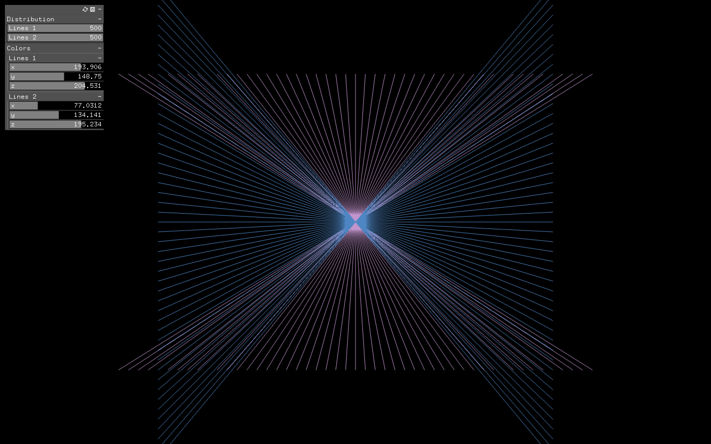
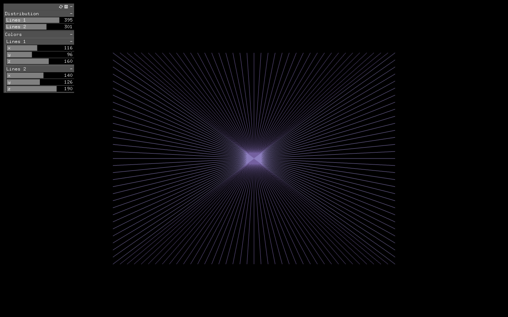

# oF_lines
An openFrameworks app that makes a drawing with lines and points that can be controlled by sliders.

In my applicattion, there are 2 different sliders:
- sliders which control the number of lines
- sliders which control the color of the lines

Using sliders under the label "Distribution", we can increase and decrease the number of lines. All the lines originate from the center, however, while the first slider draws lines that are spreading horizontally, the second slider draws lines that are spreading vertically.

The color of those 2 groups of lines is controlled by the sliders located under the label "Colors". The x, y,and z values of those sliders correspond to R, G ,B values, respectively.

Sometimes those two groups of lines can overlap, and sometimes they work along to create a rectangle.

