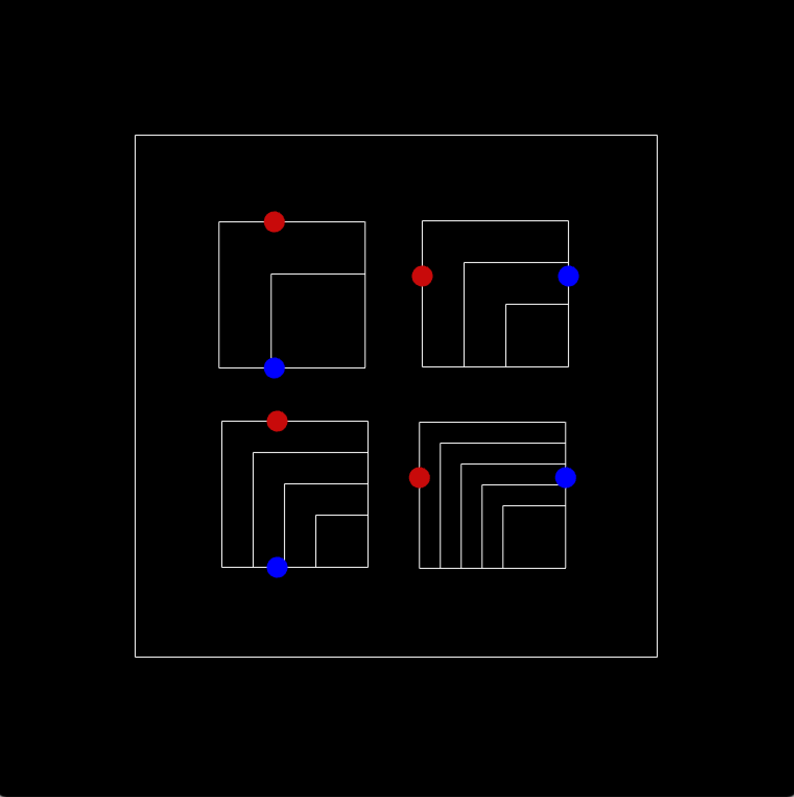
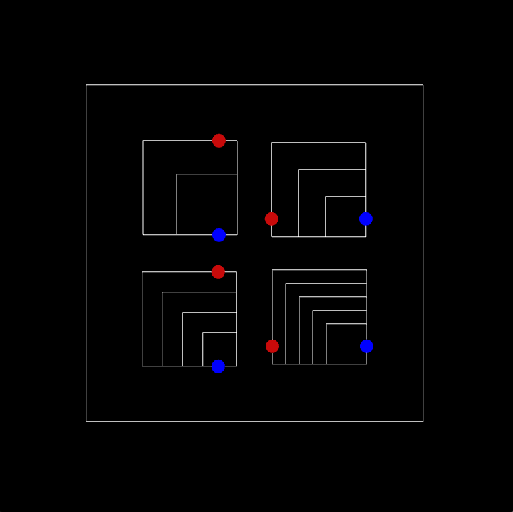

# Sketch 2

In this sketch, I'm mainly relying on ofNoise() and ofGetElapsedTimef() functions to draw floating rectangles. On those rectangles, there are circlular balls that are moving on the specific sides in a cyclical motion i.e. they start from one corner and once they reach the other corner along the edge of the rectangle that they're following, their position will restart to the initial corner.

Despite the fact that this is a fairly simple example of cyclic animation, for me an important part of working on this sketch was getting acquainted with ofNoise() and ofGetElapsedTimef() functions, which are frequently used in many types of OF animations and which can later be useful when working on Assignment2.

Here's the link to the recording of my animation: https://youtu.be/7Mi2wHqn5yc

Here are some screenshots from my sketch: 

(P.S. the floating of rectangles may not be noticeable from the screenshots as the floating value is fairly small thus the change in the postion of rectangles is also small)

